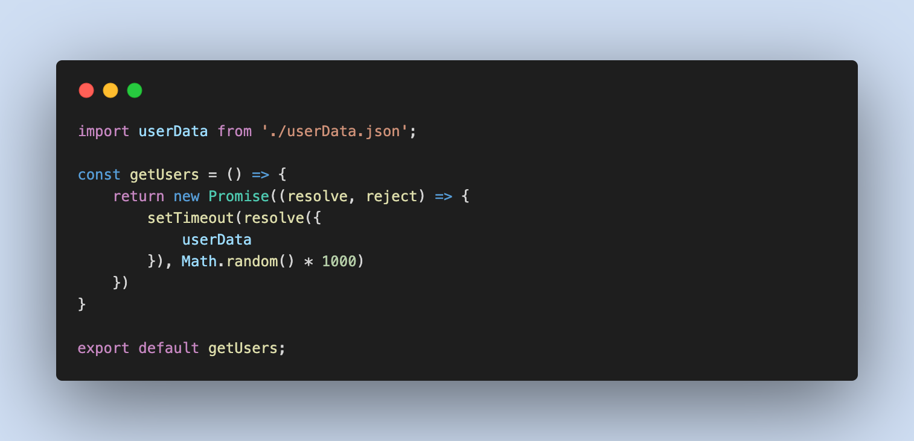
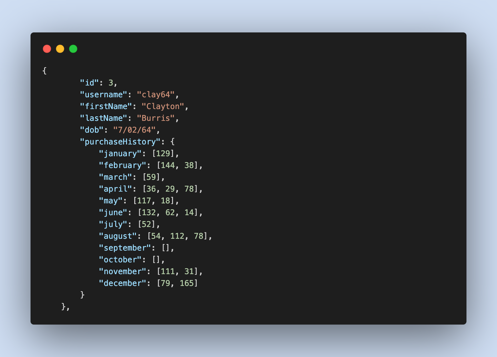
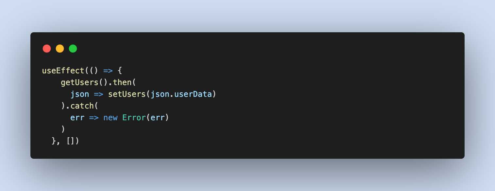
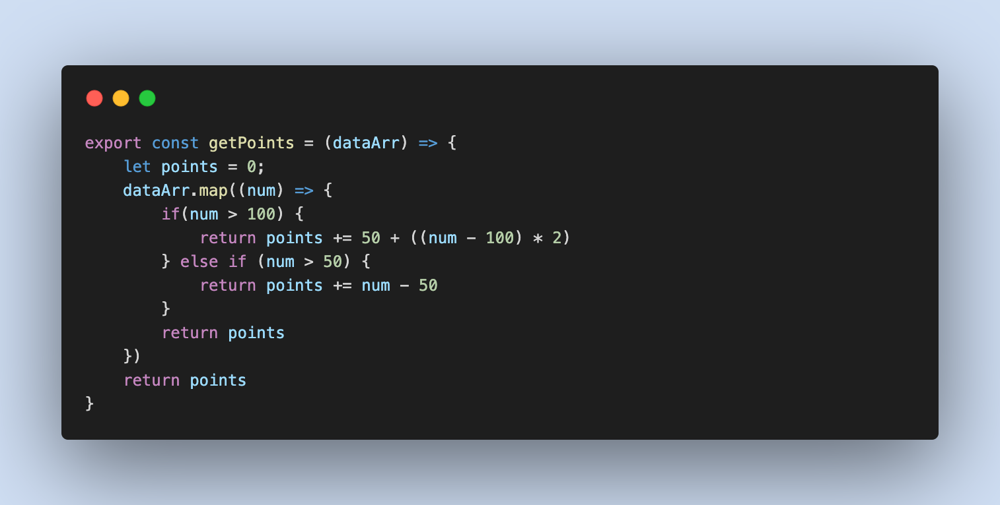
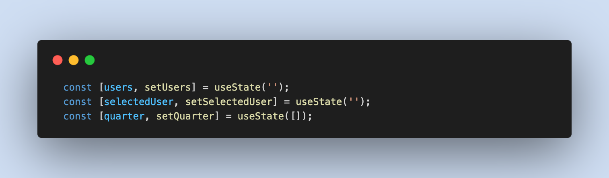

# pointsTracker.


## Description
pointsTracker is a React app that simulates an async API fetch to retrieve user data and return the users accrued points totals based on retail purchases within a requested quarter year.

    This project uses a simulated API fetch so client side development can continue before a true backend has been completed.

    

<br />
<br />
<br />

## Table of Contents

* **[Installation](#installation)**<br />
* **[Usage](#usage)**<br />
* **[License](#license)**<br />
* **[Contributing](#contributing)**<br />
* **[Contact](#contact)**<br />

### Installation
<a name="installation"/>

```
npm install
```

### Usage
<a name="usage"/>
Simply clone the repo. Then open your terminal and navigate to the codebase. Run "npm install" and, once installation is completed, run "npm run start". A development server should spin up and open a new window in your default browser where you will see and interact with the pointsTracker client.<br />

<br />
The logic to calculate points was pretty simple given the criteria of: A customer receives 2 points for every dollar spent over $100 in each transaction, plus 1 point for every dollar spent between $50 and $100 in each transaction.

(e.g. a $120 purchase = 2x$20 + 1x$50 = 90 points).
<br />
pointsTracker is using React state management to maintain the selectedUser, selected quarter, as well as all of the Users data returned from the "API fetch"
<br />


### License
<a name="license"/>

<a href="https://choosealicense.com/licenses/isc/">isc</a><br/>
            For more information on the coverage of this license please click on the link above.

### Contributing
<a name="contributing"/>
hackpres is the primary contributor.


### Contact
<a name="contact"/>
for questions please contact <a href="https://github.com/hackpres">hackpres</a><br/>

