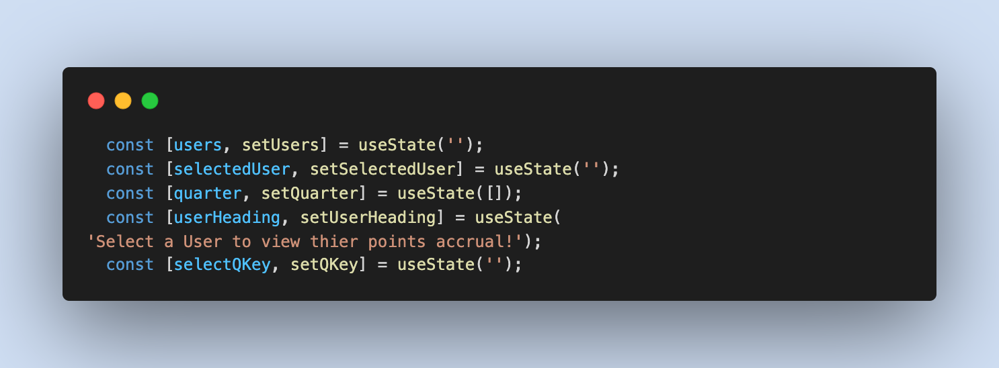

# pointsTracker.


## Description
pointsTracker is a React app that simulates an async API fetch to retrieve user data and return their accrued points based on retail purchases within a requested quarter year.

    This project tests the functionality of the application with a simulated API fetch so development can continue before a true backend has been completed.

    

<br/>


## Table of Contents

* **[Installation](#installation)**<br />
* **[Usage](#usage)**<br />
* **[License](#license)**<br />
* **[Tests](#tests)**<br />
* **[Contributing](#contributing)**<br />
* **[Contact](#contact)**<br />

### Installation
<a name="installation"/>

```
npm install
```

### Usage
<a name="usage"/>
Simply clone the repo. Then open your terminal, navigate to the codebase run "npm install" then, once installation is completed, run "npm run start". A development server should spin up and open a new window in your default browser where you will see and interact with the pointsTracker client.<br/>

<br/>


### License
<a name="license"/>

<a href="https://choosealicense.com/licenses/isc/">isc</a><br/>
            For more information on the coverage of this license please click on the link above.

### Tests
<a name="tests"/>

```
npm test
```

### Contributing
<a name="contributing"/>
hackpres is the primary contributor.


### Contact
<a name="contact"/>
for questions please contact <a href="https://github.com/hackpres">hackpres</a> at hackeralexanderp@gmail.com.<br/>

